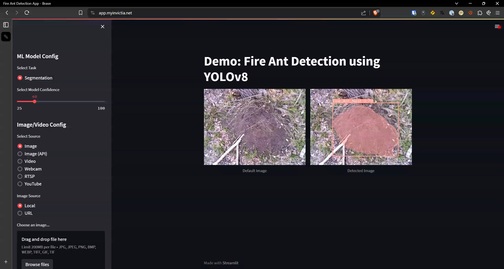
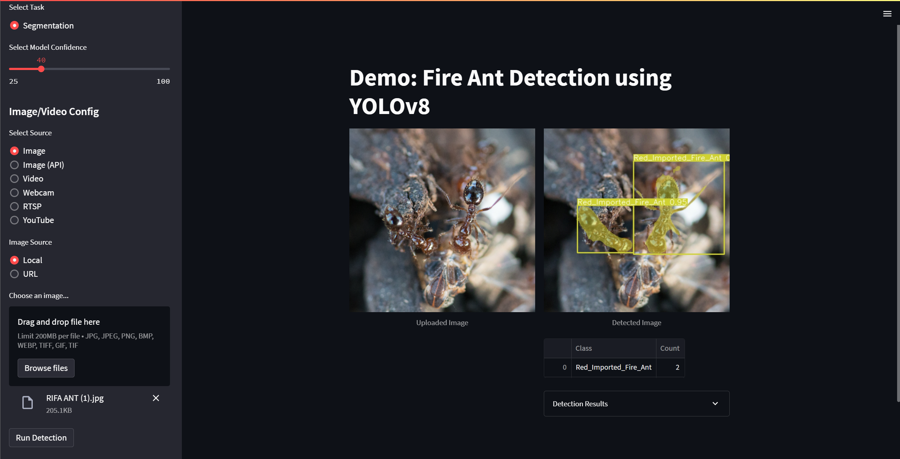

# 🌟🐜 Real-time Fire Ants and Nests Detection and Tracking with YOLOv8 and Streamlit 🎉👀
Get ready for cutting-edge object detection magic! This web app combines the power of YOLOv8 🔍 for object detection and segmentation with the simplicity of the Streamlit framework to deliver real-time object detection and tracking in video streams. ✨🎥

## Announcements
- 🏆🎉 We are excited to announce that our team, MyInvictIA, has secured the third position in the Huawei ICT Competition at the Innovate Stage 2023-24! We are honored by this achievement and also pleased for participating in the last Castilla y León's Boards Innovation Contest 2024. 

## 📝⌛ To Do
- [X] Examples of the app running.
- [ ] Examples of API usage.
- [ ] 🔄 Migrate the application to a new Dashboard based on Vue.js and Flask among others.

## 🚀💻 Demo WebApp
[Demonstration of WebApp](./assets/videos/achieved-results.mp4)
- Check out this app in action 🏃‍♂️ – it's up and running on the Streamlit cloud server! ☁️ Thanks to the fantastic folks at Streamlit for supporting the community with cloud uploads. Here's where you can see it live:
- [Demo Web App Avaidable](https://myinvictia-yolov8-app.streamlit.app/)
- ⚠️ Note: The cloud server may take a few seconds to load the app. Please be patient! 🕰️

## 🕵️‍♀️🔎 Tracking with Object Detection Demo Video
Coming soon! 📹 Stay tuned for a demo showcasing this awesome feature

## 📸📷 Demo Pics
- Home page 🏠

## 📸🔍 Page after uploading an image and object detection

## 📦🔨 Python's Requirements and Versions

- aiofiles==23.2.1
- fastapi==0.110.2
- numpy==1.24.4
- opencv_python_headless==4.8.1.78
- lapx==0.5.7
- python-multipart==0.0.9
- python-dateutil==2.8.2
- DateTime==5.5
- pandas==2.0.3
- Pillow==10.3.0
- pytube==15.0.0
- Requests==2.31.0
- streamlit==1.33.0
- ultralytics==8.1.38
- uvicorn==0.29.0
- torch==2.2.2+cpu
- torchvision==0.17.2+cpu

## 🌟🔭🔧 How to Install Python 3.10 in Ubuntu
1. If you already have Python installed, you can skip the following steps until cloning the repo, if not run the following commands to install Python 3.10 in Ubuntu.
2.  Update Ubuntu before installing Python: `sudo apt update && sudo apt upgrade` 
3. Import Python PPA on Ubuntu: `sudo add-apt-repository ppa:deadsnakes/ppa`
4. Refresh APT Sources List for Python PPA on Ubuntu: `sudo apt update`
5. Install Python 3.10 on Ubuntu: `sudo apt install python3.10 && sudo apt install python3.10-venv`
6. Verify Python 3.10 Installation on Ubuntu: `python3.10 --version`

## 🌟🔭🔧 How to Run Locally just with Python and Virtual Environment
1. Clone this repo: `git clone https://github.com/MyInvictIA/yolov8-streamlit-fireant-tracking.git`
2. Hop into the directory: `cd yolov8-streamlit-fireant-tracking/yolov8_app/`
<!-- 3. Install Git LFS: `sudo apt install git-lfs`
4. Initialize Git LFS: `git lfs install`
5. Pull the LFS files: `git lfs pull`-->
3. Run the following command to create a python environment: `python3.10 -m venv env`
4. Activate the environment with: `source env/bin/activate`
5. Install the requirements: `pip install -r requirements.txt`
6. Run the app: `streamlit run app.py --server.port 8501 & uvicorn main:app --host 0.0.0.0 --port 8000 --reload`
7. Open a browser and get into the following URL for the Web App: `http://localhost:8501`
8. Open a browser and get into the following URL for the API: `http://localhost:8000/docs`

## 🌟🔭🐋 How to Run Locally with Docker Compose
1. Clone this repo: `git clone https://github.com/MyInvictIA/yolov8-streamlit-fireant-tracking.git`
2. Hop into the directory: `cd yolov8-streamlit-fireant-tracking/`
<!--3. Install Git LFS: `sudo apt install git-lfs`
4. Initialize Git LFS: `git lfs install`
5. Pull the LFS files: `git lfs pull`-->
3. Launch the app: `docker-compose -f ./docker-compose.yml up -d`
4. And if you want to sync changes in real-time: `docker-compose -f .\docker-compose.yml watch`
5. Open a browser and get into the following URL for the Web App: `http://localhost:8501`
6. Open a browser and get into the following URL for the API: `http://localhost:8000/docs`

### 🔧🧰 ML Model Config
- Task time! Choose your mission: 🎯 Segmentation* supported only.
- Set your confidence level for the model, using the slider to adjust the confidence threshold (25-100).
- Once the model config is good to go, pick your source.

### 🖼🔍 Image Detection
- The default image and its object-detected counterpart are proudly displayed on the main page.
- Choose your source (the "Image" radio button – ready for local uploads or internet images).
- Click "Browse files" to upload your image.
- Hit the "Detect Objects" button, and watch the object detection algorithm work its magic on your image with your chosen confidence threshold.
- The result – your image with detected objects – will appear. Click "Download Image" to save it!

## 🎬🔎 Detection in Videos
- Demo Coming soon!.

- Press on `Detect Objects in Video ` button and the selected task will start on the selected video.

### 🌐🔍 Detection on RTSP
- Select the RTSP stream button
- Enter the RTSP URL and press the "Detect Objects" button

### ▶️🔮 Detection on YouTube Video URL
- Choose YouTube as your source
- Paste the URL into the text box.
- Let the detection/segmentation task do its thing on the YouTube video!

## 🙏☺️ Acknowledgements

- This app owes its awesome object detection skills to the YOLOv8 algorithm (<https://github.com/ultralytics/ultralytics>).
- The Streamlit library (<https://github.com/streamlit/streamlit>) makes building the user interface a breeze.
- The original code is based in the source code from [CodingMantras/yolov8-streamlit-detection-tracking](https://github.com/CodingMantras/yolov8-streamlit-detection-tracking)

## ⚠️😅 Disclaimer
- This project is currently rockin' the educational world.  Hold tight before deploying it in production environments! 🚀
- If you love this repo, don't forget to leave a star! ⭐

## 🏆🌐 Contests and Competitions
This project has taken part in the following contests and competitions:
- [Castilla y León's Boards Innovation Contest 2023](https://www.tramitacastillayleon.jcyl.es/web/jcyl/AdministracionElectronica/es/Plantilla100Detalle/1251181050732/Premio/1285312846458/Propuesta)
- [Huawei ICT Competition in the Innovate Stage 2023-24.](https://e.huawei.com/en/talent/#/ict/innovation-details?zoneCode=071217&zoneId=98269613&compId=85131995&divisionName=Europe&type=C002&isCollectGender=N&enrollmentDeadline=null&compTotalApplicantCount=39)
