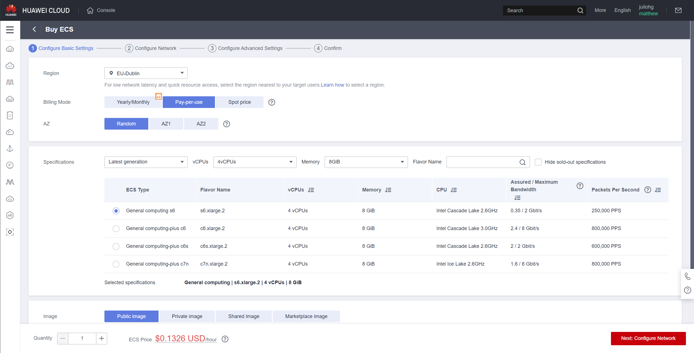
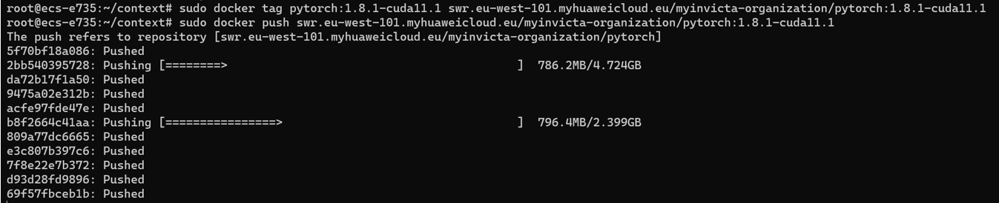
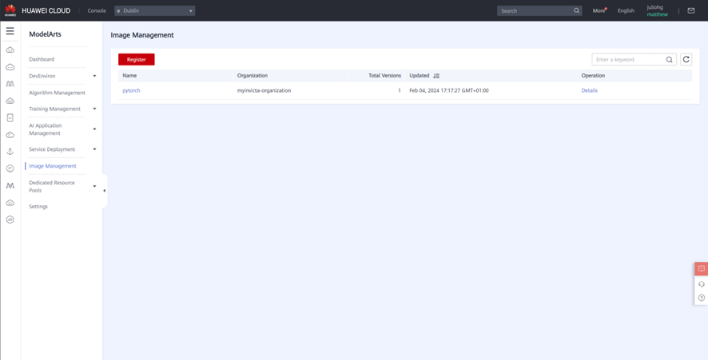
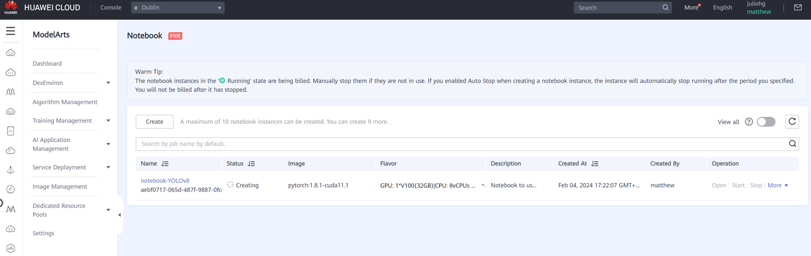
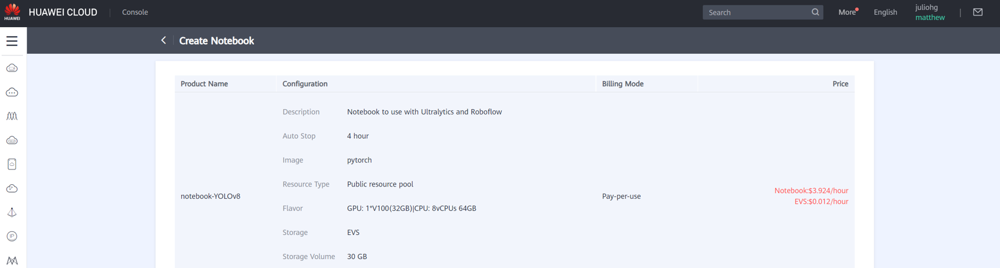
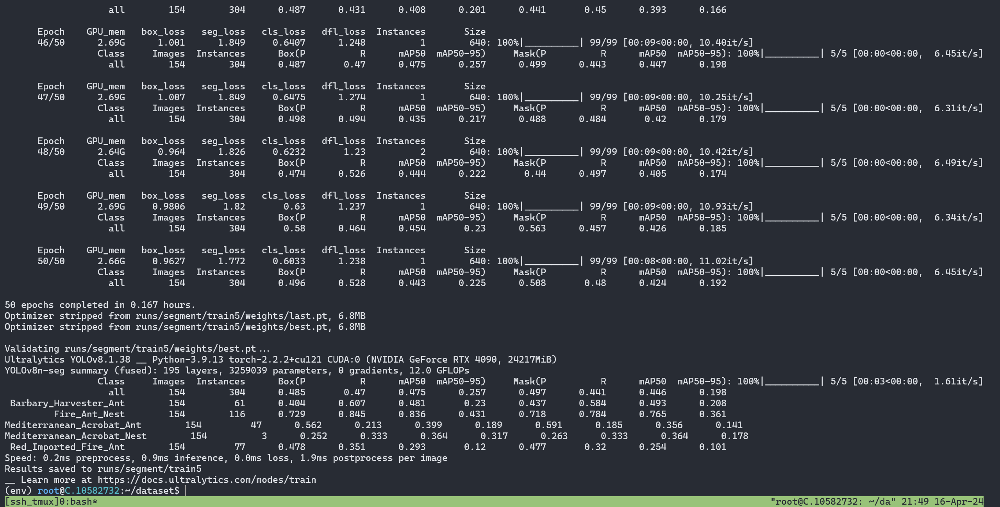

## Table of Contents

1. [Create a Docker Image for Training a Model](#create-a-docker-image-for-training-a-model)
2. [Upload the Docker Image to the Huawei Cloud](#upload-the-docker-image-to-the-huawei-cloud)
3. [Manage the Image on the Huawei Cloud](#manage-the-image-on-the-huawei-cloud)
4. [Open the Junyper Notebook and run the following commands to create a Docker Image.](#open-the-junyper-notebook-and-run-the-following-commands-to-create-a-docker-image)
5. [Upload the algorithm model to Roboflow](#upload-the-algorithm-model-to-roboflow)

# Create a Docker Image for Training a Model
We built our own Docker Image based on a Hawei Docker with CUDA support.
1. Get an Elastic Cloud Server (ECS) instance with only CPU, RAM and Disk resources. We used **s6.xlarge.2** with 4 vCPUs, 8 GB RAM and 110 GB Disk.

2. Install Docker on the ECS instance.
```bash
curl -fsSL https://get.docker.com -o get-docker.sh
sh get-docker.sh
docker --version
```
3. Download the dependencies:
```bash
mkdir -p context && cd context
wget https://download.pytorch.org/whl/cu111/torch-1.8.1%2Bcu111-cp38-cp38-linux_x86_64.whl
wget https://download.pytorch.org/whl/cu111/torchvision-0.9.1%2Bcu111-cp38-cp38-linux_x86_64.whl
wget https://download.pytorch.org/whl/torchaudio-0.8.1-cp38-cp38-linux_x86_64.whl
wget https://repo.anaconda.com/miniconda/Miniconda3-py38_4.12.0-Linux-x86_64.sh
```
4. Create a pip.conf file with the following content:
```bash
nano pip.conf
# Copy and paste the following lines:


[global]
index-url = https://repo.huaweicloud.com/repository/pypi/simple
trusted-host = repo.huaweicloud.com
timeout = 120
```
4. Create a Dockerfile with the following content:
```bash
nano Dockerfile
# Copy and paste the following lines:


# The host must be connected to the public network for creating a container image.

# Base container image at **https://github.com/NVIDIA/nvidia-docker/wiki/CUDA**
# 
# https://docs.docker.com/develop/develop-images/multistage-build/#use-multi-stage-builds
# require Docker Engine >= 17.05
#
# builder stage
FROM nvidia/cuda:11.1.1-runtime-ubuntu18.04 AS builder

# The default user of the base container image is **root**.
# USER root

# Use the PyPI configuration provided by Huawei Mirrors.
RUN mkdir -p /root/.pip/
COPY pip.conf /root/.pip/pip.conf

# Copy the installation files to the **/tmp** directory in the base container image.
COPY Miniconda3-py37_4.12.0-Linux-x86_64.sh /tmp
COPY torch-1.8.1+cu111-cp37-cp37m-linux_x86_64.whl /tmp
COPY torchvision-0.9.1+cu111-cp37-cp37m-linux_x86_64.whl /tmp
COPY torchaudio-0.8.1-cp37-cp37m-linux_x86_64.whl /tmp

# https://conda.io/projects/conda/en/latest/user-guide/install/linux.html#installing-on-linux
# Install Miniconda3 to the **/home/ma-user/miniconda3** directory of the base container image.
RUN bash /tmp/Miniconda3-py37_4.12.0-Linux-x86_64.sh -b -p /home/ma-user/miniconda3

# Install torch*.whl using the default Miniconda3 Python environment in **/home/ma-user/miniconda3/bin/pip**.
RUN cd /tmp && \
    /home/ma-user/miniconda3/bin/pip install --no-cache-dir \
    /tmp/torch-1.8.1+cu111-cp37-cp37m-linux_x86_64.whl \
    /tmp/torchvision-0.9.1+cu111-cp37-cp37m-linux_x86_64.whl \
    /tmp/torchaudio-0.8.1-cp37-cp37m-linux_x86_64.whl

# Create the final container image.
FROM nvidia/cuda:11.1.1-runtime-ubuntu18.04

# Install vim and cURL in Huawei Mirrors.
RUN cp -a /etc/apt/sources.list /etc/apt/sources.list.bak && \
    sed -i "s@http://.*archive.ubuntu.com@http://repo.huaweicloud.com@g" /etc/apt/sources.list && \
    sed -i "s@http://.*security.ubuntu.com@http://repo.huaweicloud.com@g" /etc/apt/sources.list && \
    apt-get update && \
    apt-get install -y vim curl && \
    apt-get clean && \
    mv /etc/apt/sources.list.bak /etc/apt/sources.list

# Add user **ma-user** (UID = 1000, GID = 100).
# A user group whose GID is 100 of the base container image exists. User **ma-user** can directly use it.
RUN useradd -m -d /home/ma-user -s /bin/bash -g 100 -u 1000 ma-user

# Copy the **/home/ma-user/miniconda3** directory from the builder stage to the directory with the same name in the current container image.
COPY --chown=ma-user:100 --from=builder /home/ma-user/miniconda3 /home/ma-user/miniconda3

# Configure the preset environment variables of the container image.
# Set **PYTHONUNBUFFERED** to **1** to avoid log loss.
ENV PATH=$PATH:/home/ma-user/miniconda3/bin \
    PYTHONUNBUFFERED=1

# Set the default user and working directory of the container image.
USER ma-user
WORKDIR /home/ma-user
```
5. Build the Docker Image with the following command:
```bash
docker build . -t pytorch:1.8.1-cuda11.1
```

# Upload the Docker Image to the Huawei Cloud
From Huawei Cloud Console, go to SWR (Software Repository for Container) and create your organization. Then, get a docker login command and run it in the terminal. Finally, push the Docker Image to the Huawei Cloud.
The docker login command should look like this:
```bash
docker login -u eu-west-101@YOUR_API_KEY_ORGANIZATION -p YOUR_API_KEY_HERE swr.eu-west-101.myhuaweicloud.eu
```
Once inside, tag the Docker Image and push it to the Huawei Cloud:
```bash
sudo docker tag pytorch:1.8.1-cuda11.1 swr.eu-west-101.myhuaweicloud.eu/myinvictia-organization/pytorch:1.8.1-cuda11.1
sudo docker push swr.eu-west-101.myhuaweicloud.eu/myinvictia-organization/pytorch:1.8.1-cuda11.1
```

# Manage the Image on the Huawei Cloud
Once the Docker Image is uploaded to the Huawei Cloud, to use it on ModelArts you must assign the image first. Go to **ModelArts Console** > **Image Management**. Then, click on **Register** and select the Docker Image you uploaded previously.

# Open the Junyper Notebook and run the following commands to create a Docker Image.
Once you deploy the Docker Image in a **Model Arts Notebook**, you can run the following commands to download the necessary dependencies for training a model.

We used a Notebook with the following configuration, 8 vCPUs, 64 GB RAM, 30GB Disk and 1 NVIDIA V100 GPU (32 GB).

In the Notebook terminal, the following commands can be used to download the necessary dependencies and dataset for training a model with any weights of YOLOv8. The commands are as follows:
```bash
# Check the NVIDIA GPU
nvidia-smi

# Create a virtual environment for python
mkdir -p dataset && cd dataset
python -m venv env
source env/bin/activate

# Download the dataset from Roboflow
curl -L "YOUR_OWN_ROBOFLOW_URL_AND_API" > roboflow.zip; unzip roboflow.zip; rm roboflow.zip

# Install the necessary dependencies
apt-get update && apt-get install libgl1

python -m pip install --upgrade pip
pip install ray[tune]==2.9.3
pip install 'cupy-cuda115>=9.5.0,<12.0.0a0'
pip install cython
pip install 'cuda-python>=11.5,<11.7.1'
pip install roboflow
pip install ultralytics=

# Train the model with YOLOv8n-seg
yolo task=segment mode=train model=yolov8n-seg.pt data=./data.yaml epochs=100 imgsz=640
```
*We also used a RTX 4090 to train for fun ;)

# Upload the algorithm model to Roboflow
From the same terminal in the notebook, you can upload the trained model to Roboflow with the following command:
```bash
cd dataset
python
from roboflow import Roboflow  
 
rf = Roboflow(api_key="Your_Roboflow_API_Key")  
project = rf.workspace("myinvictia").project("Your_Project_Name")  
  
project.version(5).deploy(model_type="yolov8n-seg", model_path=f"./runs/segment/train/")
```
